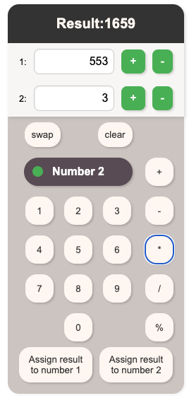
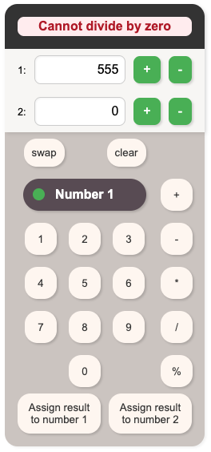

# Elm Calculator

## Setup
```
elm init
```

- create `Main.elm`
```
elm make src/Main.elm --output elm.js
```
- use the elm.js in the index.html as you need it

## Application
- simple calculator application written in elm.
- it supports the following operations:
    - multiply
    - subtract
    - add
    - divide
    - modulo
    - increment
    - decrement
    - swaping numbers
    - entering numbers via keyboard
    - selecting number via click in input or toggle button




- it verify that division by zero is not performed


